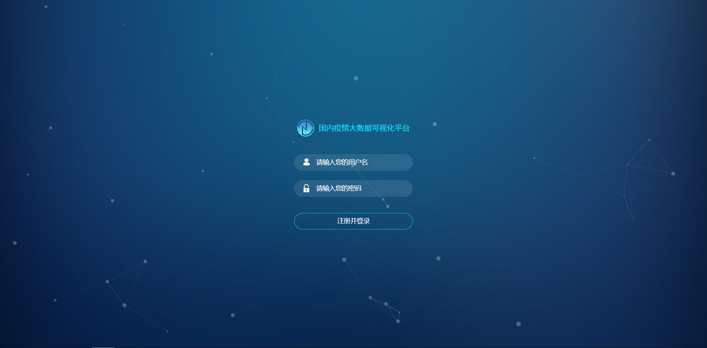

# COVID-19-Django

[](https://python.org/)  [](https://docs.djangoproject.com/zh-hans/4.1/) [](https://echarts.apache.org/zh/index.html) 

[中文](./README.md) | [preview](http://www.henglulu.top)  | [Group chat](https://jq.qq.com/?_wv=1027&k=sLyuUZHU) | [Gitee](https://gitee.com/Heng-Xiao/covid-19-django) | [Github](https://github.com/Heng-Xiao/covid-19-django) 


💡 **「About ME」**

A flower may bloom again, but a man is never young again.

Hello, everyone. I am a post-00s rookie who graduated in 2022. I like to write blindly at ordinary times.

motto：Practice is diligent, shortage in one; Success depends on thought and ruin.

Because of love, so embrace the future.

Good things always happen in the next turn, I wish you all wish come true!!

## Platform introduction

[COVID-19-Django](https://gitee.com/Heng-Xiao/covid-19-django) The main purpose of China's big data visualization platform is to more intuitively follow and grasp the progress of novel coronavirus pneumonia prevention and control in real time, to more intuitively understand the national epidemic situation, and to take timely and effective prevention and control measures. With the solution of data visualization technology, the data information is not only for decision makers, but also for authorized display to the public. Through big data visualization, we can more clearly and intuitively understand the number of infected people across the country in the current epidemic, so as to understand the changing trend of the epidemic.

This system uses Django architecture to develop web applications, uses Echarts to draw basic charts, uses requests library in Python language to crawl epidemic data from some news sites down cleaning and then stored in MySQL, realizes the permanent storage of data, as well as real-time update data, not only convenient, But also to ensure the security of the data.

💡 [COVID-19-Django](https://gitee.com/Heng-Xiao/covid-19-django) Django-based domestic epidemic visualization platform, now open source sharing.


* 🧑‍🤝‍🧑[Echarts](https://echarts.apache.org/zh/index.html) 、[Jquery](https://jquery.com/)、Ajax、HTML、CSS、and other technologies are used in the front end。
* 💡The back-end uses the Python language [Django](https://www.djangoproject.com/) framework.


## Online experience

👩‍👧‍👦Demo address：[http://www.henglulu.top](http://www.henglulu.top) 

- Account number：admin 

- password：admin


## communication

- Learn to communicate with QQ groups：961263329     [Click here to join the group chat](https://jq.qq.com/?_wv=1027&k=sLyuUZHU)

- Welcome to follow my wechat public account

  


## Source address

gitee address(Main thrust)：[https://gitee.com/Heng-Xiao/covid-19-django](https://gitee.com/Heng-Xiao/covid-19-django)👩‍👦‍👦

github address：[https://github.com/Heng-Xiao/covid-19-django](https://github.com/Heng-Xiao/covid-19-django)👩‍👦‍👦


## Built-in function

1.  👨‍⚕️User login: User login and registration functions.
2.  👩‍⚕️Data crawling: Data crawling scripts GetData.py and SaveMysqlData.py directly crawled epidemic data into the MySQL database.
3.   :grapes: Data update: Data crawl and update data.
4.  👨‍🎓Large screen for epidemic visualization: Data is extracted from MySQL database and collated for data visualization.


## Detailed structure

```
- covids19 Project name
    - connect.py Database configuration correlation
    - GetData.py Python data crawler related
    - indexdata.py Data encapsulation correlation
    - SaveMysqlData.py Save the crawled data to the MySQL database
    - settings.py Very important. The whole project is started by the configuration file
    - urls.py Route (total route)
    - views.py View function (emphasis)
    - wsgi.py Configure the wsgi server
- static Path for storing static resources
- templates The template files (html one by one) that pycharm created to have this folder
- venv Project virtual environment management
- covid-19.sql The data table in the database
- manage.py Start project, create app, various command operation
- requirements.txt Dependencies needed to run the project
```


## Preparatory work
~~~
Python >= 3.8.0 (Version 3.8+ is recommended)
Mysql >= 5.7.0 (Optional. The default database is sqlite3. 8.0 is recommended)
PyCharm >= 2021
Operating system (Windows10 is recommended)
~~~

## Preparation for operation♝

```bash
--1.Example Create a new database covid-19 in the MySQL database

--2.Import the data from the covid-19 19.sql file into the database

--3.Installation dependent environment
pip install -r requirements.txt

--4.Changing the database Password
--Go to connect.py and settings.py files to modify

--connect.py
conn = Connect(user="root",
                   password="000000",
                   host="127.0.0.1",
                   database="covid-19",
                   port=3306,
                   charset="utf8", )
--settings.py
DATABASES = {
    'default':
    {
        'ENGINE': 'django.db.backends.mysql',    # Database engine
        'NAME': 'covid-19', # Database name
        'HOST': '127.0.0.1', # Database address, local ip address 127.0.0.1
        'PORT': 3306, # port
        'USER': 'root',  # Database user name
        'PASSWORD': '000000', # Database password
    }
}

--5.Launch project
python3 manage.py runserver 0.0.0.0:8000
```


### Access item

- Access address：[http://localhost:8000](http://localhost:8000) (The default address is this one. If you want to change it, follow the configuration file)
- Account number：`admin` password：`admin`


## Demonstration drawing✅





## Follow-up plan

1.  👨‍⚕️Epidemic data background management: used to manage epidemic data information and crawler script information.
2.  👩‍⚕️Add Redis technology: Optimize the visualization of large screen query data time.
3.  👨‍🎓Add kafka technology: will climb to the data written to kafka, and then to consume the data, either after the data cleaning into the database or the data out for some monitoring.

At present, because my time is limited and the novel coronavirus epidemic has been opened and unsealed, the data will not be updated and maintained. I'm not going to do that, but you can do it yourself if you're interested.
